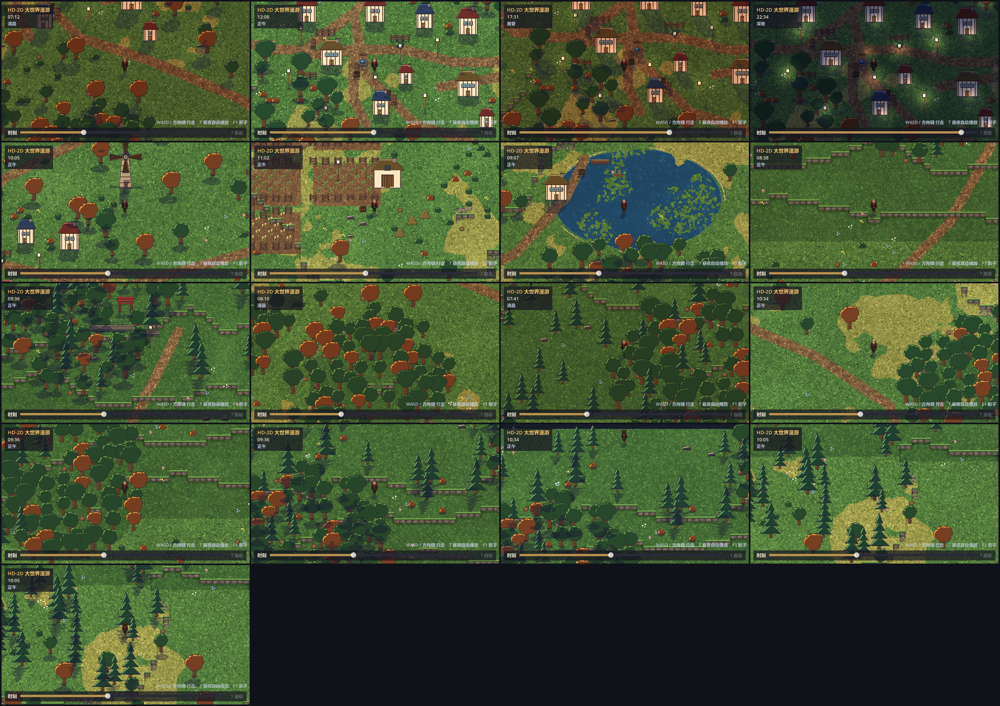

# HD-2D 大世界行走

《八方旅人》式的**斜俯视伪立体**行走 Demo，Godot 4.6。

一位旅人走过平原、翻上台地、穿过村庄与松林、绕过湖泊。地面有真实的高度台阶，
角色上下坡时会被坡上的树挡住、走到屋后会被屋檐挡住；世界有天光，从清晨到深夜连续变化。



## 运行

```bash
D:/godot/Godot_v4.6.2-stable_win64.exe --path .
```

或用编辑器打开本目录后按 F5。

主场景是 autoload 单例 `Main`（`scenes/main.tscn`），随项目启动自动实例化；
`run/main_scene` 指向空场景 `stub.tscn` 占位，避免重复加载。

### 操作

| 按键 | 作用 |
| --- | --- |
| `WASD` / 方向键 | 四方向行走（行走 6 帧 / 待机 2 帧动画，四方向各自成组） |
| 底部滑条 | 连续拖动时间：0.00 午夜 → 0.25 日出 → 0.50 正午 → 0.75 日落 |
| `T` | 昼夜自动播放开关 |
| `F1` | 影子显示开关（想看投影有没有算对时用） |
| `F2` | HUD 显示开关 |

## 世界

| | |
| --- | --- |
| 尺寸 | 192 × 108 格 = 3072 × 1728 像素 |
| 格 | `TILE = 16`，地面行高 `ROW_H = 16`，每级高度 `ELEV_H = 12` |
| 高度 | 0 ~ 3 级，相邻格高差只有 0 或 ±1（全是台阶，没有断崖） |
| 内容 | 1916 个物件、41 种精灵、27 条地形带 |

地形内容：南方平原与草场、中部的**三级台地**（带石砌崖壁的上下坡）、
约 15 户人家沿街排布的**村庄**（水井、灯柱、篱笆、菜园、风车、告示牌）、
农田与谷仓、东北的湖泊（浅滩 / 深水 / 码头 / 渔屋 / 苇丛）、
北岭的针叶林与山巅鸟居神社、散布各地的阔叶林与秋林。

## 投影怎么来的

整套画面只有一个假设：**相机从正南方斜上方看下来**。

设某点在世界里位于格 `(tx, ty)`、地面高度 `h`，则画到屏幕上的位置是

```
screen = (tx · TILE,  ty · ROW_H − h · ELEV_H)
```

`ty · ROW_H` 是它沿地面往南走的位移，`h · ELEV_H` 是它被抬高后往屏幕上方的位移。
两者相除就定死了俯角：`tanθ = ROW_H / ELEV_H = 16/12`，约 53°。

排序（谁挡住谁）用另一个量，叫**深度键**：

```
z = ty · ELEV_H + h · ROW_H
```

`ty` 越大越靠近相机，`h` 越高越靠近相机，两者权重正好是投影的逆。见
[`scripts/proj.gd`](scripts/proj.gd)，地形、物件、角色、影子全都只从这里取数。

分层取值：

| 层 | z |
| --- | --- |
| 地形带 `b`（4 行一带） | `12 · 首行 − 1` |
| 物件 / 角色 | `12 · ty + 16 · h` |
| 影子 | `4095`（压在除 HUD 外的一切之上） |

地形带减 1 是为了让"同一条带上的物件"能盖住带子本身，而"更靠南的带子"又能盖住带上的物件。

## 影子为什么不用 DirectionalLight2D

试过，不行：Godot 的 2D 平行光**影子长度是无限的**，一棵树会拖出一道贯穿屏幕的斜条；
`DirectionalLight2D.height` 只影响法线贴图，对长度毫无作用（实测 400 / 120 / 40 三档完全一样）。

改用数学上等价的**仿射投影**。精灵上离脚底 `p` 像素高的那一点，影子落在脚底偏移
`(s·p, t·p)` 处。这正是一个线性变换，于是"影子"就是把精灵图按矩阵
`[[1, −s], [0, −t]]` 变换一次——

```gdscript
draw_set_transform_matrix(Transform2D(Vector2(1, 0), Vector2(-s, -t), origin))
draw_texture_rect_region(tex, Rect2(0, 0, w, h), region)
```

逐像素一一对应，不用求交、不用遮挡体，长度天然可控。
着色器只保留精灵的 alpha、统一染成一种冷色（否则红屋顶会投出红影子）。
见 [`scripts/shadows.gd`](scripts/shadows.gd) 与 [`scripts/shadow.gdshader`](scripts/shadow.gdshader)。

影子**越长越淡**：一抹影子挡下的光是一定的，摊到更长的面积上每像素自然更浅。
不做这一步的话清晨黄昏会得到"又长又黑"的影子，把整片地糊死。

## 光照

三层叠加，各管一件事（[`scripts/daynight.gd`](scripts/daynight.gd)）：

1. `CanvasModulate` —— 环境色，决定"这一刻世界整体偏什么颜色"
2. `DirectionalLight2D`（日 / 月）—— 只贡献颜色和强度，投影交给上面那套
3. `PointLight2D` —— 夜里亮起的灯柱、窗火、神社，以及角色手提的灯

关键约束：**Godot 2D 里环境色与平行光是相加的**，两者之和必须压在 1.0 附近，
超过 1.3 画面整体过曝、草地会变成荧光绿。全部时刻由一张关键帧表 `KEYS` 定义，
相邻关键帧之间线性插值。

夜里角色提的灯不是为了好看——没有它，人在暗蓝里就是一团找不到的黑影。

## 目录

```
project.godot            640x360 内部分辨率，窗口 1280x720（整数倍），Forward+，最近邻采样
scenes/main.tscn         主场景（autoload）
scenes/stub.tscn         空场景占位

scripts/proj.gd          投影常量与换算（唯一的几何真相）
scripts/world_data.gd    读 world.json，提供高度 / 水面 / 阻挡查询
scripts/main.gd          装配世界：地形带、物件、角色、相机、光照、HUD
scripts/player.gd        角色：格为单位的连续坐标、平滑爬坡、四向动画、深度
scripts/daynight.gd      昼夜与光照
scripts/shadows.gd       仿射投影影子
scripts/shadow.gdshader  影子着色器（只取 alpha，统一染色）
scripts/hud.gd           标题 / 时钟 / 时间滑条

assets/world/objects.png + objects.json    物件图集（43 张精灵打成一图，便于合批）
assets/world/terrain_00..26.png            按行分带烘焙好的地形
assets/world/world.json                    高度场 / 水面 / 阻挡 / 物件 / 出生点
assets/world/light_radial.png              灯的径向衰减贴图
assets/characters/                         角色精灵表

tools/gen_assets.py      程序化生成全部像素素材（角色除外）
tools/gen_world.py       生成高度场、上色、分带烘焙、摆放物件
tools/gen_light.py       生成径向光贴图
tools/capture.gd         批量截图 + 爬坡/遮挡断言
tools/bench.gd           四方向位移断言 + 帧率与绘制开销
tools/probe.gd           状态探针（角色 / 相机 / 贴图的实际数值）
tools/exp.gd             对照实验（同地点切换单个变量各出一图）
tools/sheet.py           把 captures/ 拼成一张联系表
```

重新生成素材与世界的顺序：

```bash
python tools/gen_assets.py     # -> assets/world/objects.png
python tools/gen_light.py      # -> assets/world/light_radial.png
python tools/gen_world.py      # -> assets/world/world.json + terrain_*.png
D:/godot/Godot_v4.6.2-stable_win64.exe --path . --headless --import
```

## 验证

截图看着对不算对。位置要断言，画面要量化。

```bash
# 截图 + 爬坡 + 遮挡断言（结果在 tools/captures/，联系表在 tools/_scratch/sheet.png）
D:/godot/Godot_v4.6.2-stable_win64.exe --path . -s tools/capture.gd
python tools/sheet.py

# 四方向位移 + 帧率
D:/godot/Godot_v4.6.2-stable_win64.exe --path . -s tools/bench.gd
```

当前实测：

```
CLIMB CHECK:     h 0 -> 3, y 33.0 -> 2.9 (348 帧, 停滞 0)  OK
OCCLUSION CHECK: 物件 z=476 高=96px | 北侧 z=464 (需 <) | 南侧 z=488 (需 >)  OK
BENCH 移动:      四方向各前进 12.3~13.0 格 / 150 物理帧，横漂 0.00  ->  OK
BENCH 帧率:      平均 60.0 | draw_calls 30 | 顶点 ~1050 | 物件 1916 | 影子 ~200/帧
```

> 两条经验，都是踩过的坑：
>
> - **爬坡必须断言高度，不能断言位移。** 曾经 `STEP_UP` 写成 0.10，而 `height_at()`
>   返回的是整数高度级，于是任何一级台阶都被判成悬崖、角色根本爬不上去；
>   测试写的是「高度涨了**或**往北走了」，结果角色只在平地上滑了一段，照样打勾。
> - **测试要等物理帧，不能等渲染帧。** `_physics_process` 是固定步长，
>   `await process_frame` 等的却是随负载浮动的渲染帧，两者比例不稳定——
>   同样 1500 帧有时走 30 格、有时走 3 格，测试会随机翻脸。

## 已知取舍

- 地形全是 ±1 级的**台阶**，没有不可通行的断崖。判定阈值 `STEP_UP = 1.5` 即"所有坡都能走"。
- 物件阻挡只按**脚下 1 格**（树、桶）到 5×5（房屋）计，是方格不是像素级碰撞。
- 影子是逐物件画的四边形，视野外按矩形剔除，靠屏幕边缘的物件其影子可能被提前剔掉。
